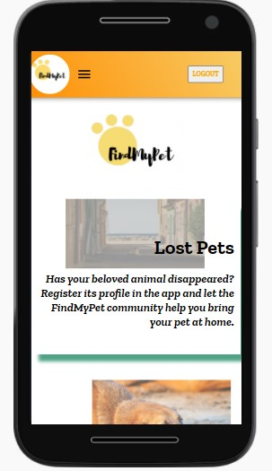
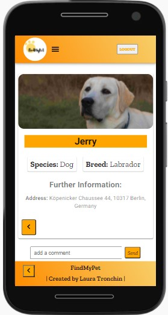
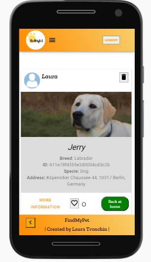
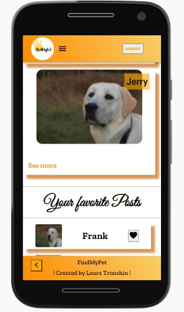
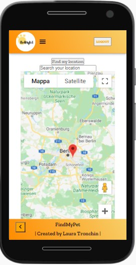

# FindMyPet
Did you lose your pet or did you see an abandoned animal on the street? Share picture and information about the pet and let the community helps you to bring it at home!
# MERN (MongoDB, Express, React, Node) Stack App 
# Further Information
- Pictures Upload: Cloudinary
- Save the location of the animal through Google Maps
- BackEnd uploaded through Heroku
- Own built Middleware to manage Token Blacklist

## Screen shots

<table style="padding:10px">
 <tr>
 <th>Home page</th>
   <th>Post details page</th>
   <th>Post Feed</th>
   <th>User Profile</th>
    <th>Map</th>
 </tr>
  <tr>
    <td> 
         </td>
      
 <td></td>
   <td></td>
     <td></td>
    <td></td>

  </tr>

</table>
